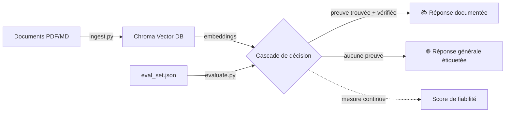

# 🧠 MEMORIX — Data Science Study Hub

Un studio de révision RAG 100% local pour la Data Science, l'IA et le MLOps.
Interroge tes propres cours (PDF, Markdown), génère quiz, flashcards et fiches
techniques, entraîne-toi à l'oral, affronte un jury en combat, duel tes camarades
— le tout avec une cascade de récupération documentaire fiabilisée et évaluée
systématiquement.


-7C5CFC)
-2FD6A0)


---

## 🎯 Pourquoi ce projet

La plupart des chatbots RAG répondent avec assurance même quand ils n'ont pas
la bonne information. MEMORIX résout ce problème avec une **cascade de
décision vérifiée** : le système ne répond depuis les documents que s'il peut
citer une phrase précise du cours qui répond réellement à la question — sinon
il bascule sur une réponse générale, clairement étiquetée comme telle.

Cette fiabilité n'est pas une promesse en l'air : elle est **mesurée**. Un
jeu de 42 questions couvrant définitions, usage de code, questions hors
corpus et pièges (`eval_set.json`) est rejoué à chaque changement via
`evaluate.py`, avec un score détaillé par catégorie d'erreur.

> **Score actuel : 42/42 (100%)** — 0 fausse citation, 0 mauvaise source,
> 0 rejet injustifié.

## ✨ Fonctionnalités

### Étude & compréhension
- **Recherche augmentée** — chat avec citation de sources, cascade documents → réponse générale
- **Synthèse & fiches techniques** — résumés structurés par section (map-reduce)
- **Atelier Code & Diagnostics** — audit de snippets Python (data leakage, fuites, bonnes pratiques)
- **Graphe de connaissances** — carte interactive cours → sections → concepts (SVG, calcul local, aucun appel LLM)

### Entraînement actif
- **Validation QCM** — quiz généré à partir du cours
- **🗂️ Flashcards** — répétition espacée (algorithme SM-2, le même que Anki)
- **🎙️ Simulation orale** — jury virtuel configurable (Lead DS, MLOps, Soutenance, Business), feedback détaillé
- **⚔️ Boss Fight** — la simulation orale transformée en combat RPG animé (SVG + sons synthétisés, aucun asset externe)
- **🤺 Duel de Révision** — face-à-face 1v1 en local, tableau des vainqueurs persistant
- **🎧 Podcast Révision** — dialogue Prof/Étudiant généré et lu à voix haute (Web Speech API, zéro fichier audio)
- **🔮 Calibration de confiance** — courbe de calibration + score de Brier : apprends à savoir quand tu sais vraiment

### Suivi
- **Métriques & Suivi** — historique de progression par section (SQLite local)
- **Plan de révision** — planificateur qui priorise les sections faibles ou jamais testées
- **Session PDF éphémère** — analyse d'un document sans l'indexer de façon permanente

## 🏗️ Architecture



La cascade fonctionne en deux étapes indépendantes, orchestrées en deux
phases distinctes pour la performance (`preparer_lot` / `juger_lot`) :
recherche vectorielle par similarité cosinus, puis un juge LLM (température 0)
qui doit **choisir une phrase précise et la voir validée par une seconde
vérification OUI/NON** avant qu'une réponse soit considérée comme documentée.

## 🛠️ Stack technique

| Composant | Choix | Pourquoi |
|---|---|---|
| LLM | Mistral (Ollama, local) | Aucune donnée envoyée à un tiers |
| Embeddings | nomic-embed-text (Ollama) | Local, léger |
| Orchestration | LangChain | Découpage sémantique, prompts |
| Base vectorielle | Chroma | Locale, persistante, gratuite |
| Interface | Streamlit | Itération rapide, composants riches |
| Auth | Google OAuth (Authlib) | Connexion sécurisée par compte |
| Persistance | SQLite | Progression, flashcards SM-2, XP, duels |
| Visuels | SVG généré en Python | Zéro asset externe, zéro dépendance JS lourde |

## 📊 Rigueur d'ingénierie

Ce projet n'a pas été construit "et ça marche" — chaque amélioration a été
validée par un cycle mesure → diagnostic → correction → re-mesure :

- `evaluate.py` — évaluation systématique sur 42 questions, avec cache pour itérer vite
- `debug_preuve.py` — diagnostic pas-à-pas de la décision du système sur une question
- `test_couverture.py` — distingue un bug de code d'une vraie lacune de contenu
- `bench_ollama.py` — a permis d'identifier et corriger un goulot d'étranglement de 70s/question (rechargement de modèle Ollama) via un traitement en deux phases

## 🚀 Installation

```bash
# 1. Cloner le dépôt
git clone https://github.com/motezjerbi/memorix-rag-studio.git
cd memorix-rag-studio

# 2. Environnement virtuel
python -m venv venv
source venv/bin/activate       # Windows : venv\Scripts\activate

# 3. Dépendances
pip install -r requirements.txt

# 4. Modèles Ollama
ollama pull nomic-embed-text
ollama pull mistral
ollama serve   # dans un terminal séparé

# 5. Indexer tes documents (dossier documents/)
python ingest.py

# 6. Lancer l'application
streamlit run app.py
```

L'authentification Google nécessite la création d'identifiants OAuth
(voir `.streamlit/secrets.toml.example`) — optionnelle pour un usage local sans partage.

## 📸 Aperçu

*(captures d'écran : accueil, Boss Fight, Duel, Calibration, Graphe de connaissances)*

## 🗺️ Pistes d'évolution

- Multi-utilisateur avec progression liée au compte Google connecté
- Export du parcours de révision en PDF de synthèse
- Support d'autres LLM locaux (Llama, Qwen) en plus de Mistral

---

*Projet personnel — développé pour explorer une cascade RAG fiable et des
formats de révision non conventionnels au-delà du simple chat.*